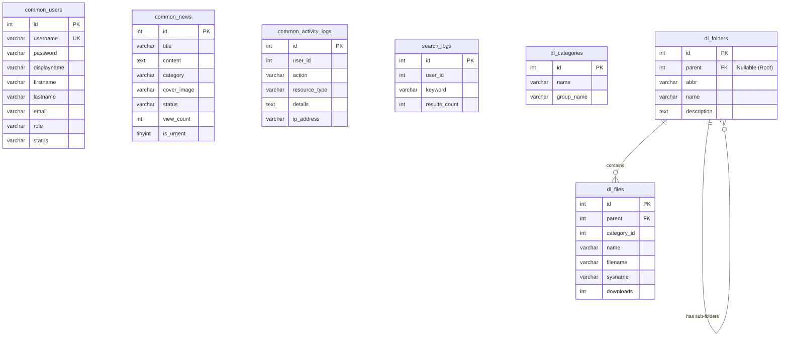

# โครงสร้างฐานข้อมูล (Database Schema)

ระบบเชื่อมต่อกับ **MySQL** (หรือ MariaDB) ภายใต้ฐานข้อมูล `casdu_cdm` โดยโครงสร้างตารางข้อมูลแบ่งออกเป็นหมวดหมู่หลักดังนี้:

## Entity-Relationship Diagram (ERD)

# โครงสร้างฐานข้อมูล (Database Schema)

ระบบเชื่อมต่อกับ **MySQL** (หรือ MariaDB) ภายใต้ฐานข้อมูล `casdu_cdm` โดยมีตารางหลักดังนี้

## 1. File System
ตารางจัดเก็บข้อมูลเอกสาร หมวดหมู่ และโฟลเดอร์

### `dl_categories` (หมวดหมู่)
| Column | Type | Description |
|---|---|---|
| `id` | INT (PK) | รหัสหมวดหมู่ |
| `name` | VARCHAR | ชื่อหมวดหมู่ |
| `group_name` | VARCHAR | กลุ่มหมวดหมู่ (เช่น เอกสารต่างๆ) |
| `isactive` | TINYINT | สถานะ (1=Active, 0=Inactive) |

### `dl_folders` (โฟลเดอร์)
| Column | Type | Description |
|---|---|---|
| `id` | INT (PK) | รหัสโฟลเดอร์ |
| `abbr` | VARCHAR | ตัวย่อหรือรหัสโฟลเดอร์ |
| `name` | VARCHAR | ชื่อโฟลเดอร์ |
| `description` | TEXT | รายละเอียด |
| `parent` | INT (FK) | รหัสโฟลเดอร์แม่ (NULL = Root) |
| `mui_icon` | VARCHAR | ชื่อไอคอน |
| `mui_colour` | VARCHAR | สีของไอคอน |
| `isactive` | TINYINT | สถานะ (1=Active, 0=Inactive) |
| `created_by` | INT | รหัสผู้สร้าง |

### `dl_files` (ไฟล์)
| Column | Type | Description |
|---|---|---|
| `id` | INT (PK) | รหัสไฟล์ |
| `parent` | INT (FK) | รหัสโฟลเดอร์ที่อยู่ |
| `category_id` | INT | รหัสหมวดหมู่ไฟล์ |
| `name` | VARCHAR | ชื่อไฟล์ที่แสดงผล (Display Name) |
| `description` | TEXT | รายละเอียดไฟล์ |
| `filename` | VARCHAR | ชื่อไฟล์เต็มพร้อมนามสกุล |
| `sysname` | VARCHAR | UUID หรือชื่อไฟล์ในระบบไฟล์เซิร์ฟเวอร์ |
| `mui_icon` | VARCHAR | ชื่อไอคอน |
| `mui_colour` | VARCHAR | สีของไอคอน |
| `downloads` | INT | ยอดดาวน์โหลด |
| `isactive` | TINYINT | สถานะ (1=Active, 0=Inactive) |
| `created_by` | INT | รหัสผู้อัปโหลด |

## 2. General Contents & User Management
ตารางข้อมูลผู้ใช้งานและข่าวประชาสัมพันธ์

### `common_users`
| Column | Type | Description |
|---|---|---|
| `id` | INT (PK) | รหัสผู้ใช้ |
| `username` | VARCHAR | ชื่อผู้ใช้/ระบบบัญชี (มักใช้ PID) |
| `password` | VARCHAR | รหัสผ่านที่เข้ารหัสแล้ว (Hash) |
| `displayname` | VARCHAR | ชื่อที่แสดงผล |
| `firstname` | VARCHAR | ชื่อจริง |
| `lastname` | VARCHAR | นามสกุล |
| `email` | VARCHAR | อีเมล |
| `jobtitle` | VARCHAR | ตำแหน่งงาน |
| `isadmin` | TINYINT | 1=Admin, 0=User |
| `role` | VARCHAR | บทบาท (admin, user) |
| `status` | VARCHAR | สถานะบัญชี (active, inactive) |

### `common_news`
| Column | Type | Description |
|---|---|---|
| `id` | INT (PK) | รหัสข่าว |
| `title` | VARCHAR | หัวข้อข่าว |
| `content` | TEXT | เนื้อหาข่าว |
| `category` | VARCHAR | หมวดหมู่ข่าว |
| `cover_image` | VARCHAR | รูปภาพหน้าปก |
| `status` | VARCHAR | สถานะของข่าว (published) |
| `view_count` | INT | ยอดเข้าชม |
| `is_urgent` | TINYINT | ข่าวด่วน (1=ด่วน, 0=ทั่วไป) |

## 3. Logs & Analytics
ตารางเก็บประวัติการใช้งานและบันทึกข้อผิดพลาดต่างๆ

### `common_activity_logs`
เก็บประวัติการใช้งานของ User และระบบ
| Column | Type | Description |
|---|---|---|
| `id` | INT (PK) | รหัสล็อก |
| `user_id` | INT | ผู้กระทำ (NULL ถ้าเป็น Anonymous) |
| `level` | VARCHAR | ระดับความสำคัญ (e.g., INFO, ERROR) |
| `action` | VARCHAR | การกระทำ (e.g., UPDATE_FILE) |
| `resource_type` | VARCHAR | ประเภทของสิ่งที่ถูกกระทำ |
| `resource_id` | VARCHAR | รหัสอ้างอิงสิ่งที่ถูกกระทำ |
| `details` | TEXT | รายละเอียดเพิ่มเติม |
| `ip_address` | VARCHAR | IP Address |
| `user_agent` | TEXT | ข้อมูลเบราว์เซอร์หรืออุปกรณ์ |

### `search_logs`
เก็บคำค้นหาเพื่อนำไปวิเคราะห์ความนิยม
| Column | Type | Description |
|---|---|---|
| `id` | INT (PK) | รหัสการค้นหา |
| `keyword` | VARCHAR | คำค้นหา |
| `user_id` | INT | ผู้ใช้งานที่ค้นหา |
| `results_count` | INT | จำนวนผลลัพธ์ที่พบ |
| `ip_address` | VARCHAR | IP Address |
| `created_at` | TIMESTAMP | เวลาที่ค้นหา |
